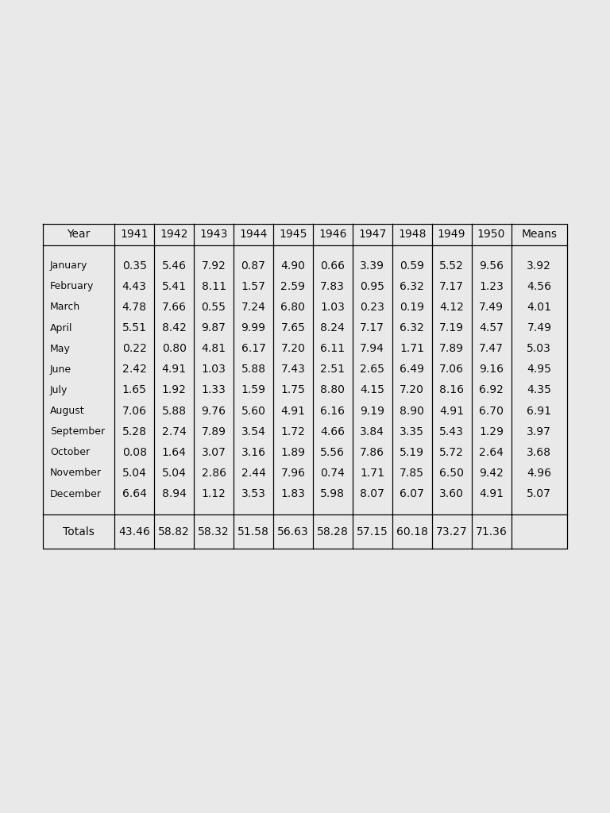

Fake images and data
====================

The fake images are based on the UK `Ten-year rainfall sheets <https://digital.nmla.metoffice.gov.uk/SO_d383374a-91c3-4a7b-ba96-41b81cfb9d67/>`_. Single-page images with a table (10 by 12) of observations, enhanced with row means and column sums. 

   An example fake image

For each year (of 10), there are data for 12 months. The data for one month is three random digits (x.yz, where x, y, and z are random digits [0-9]). So the associated data array is a 10x12x3 array of random digits.

.. literalinclude:: examples/7493.py

The challenge is to recover the data array from the image.
